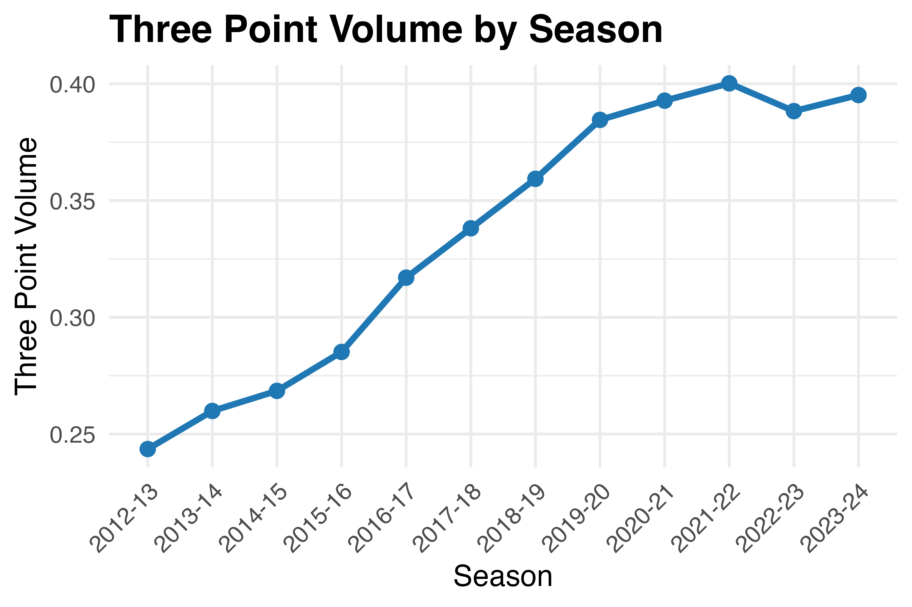
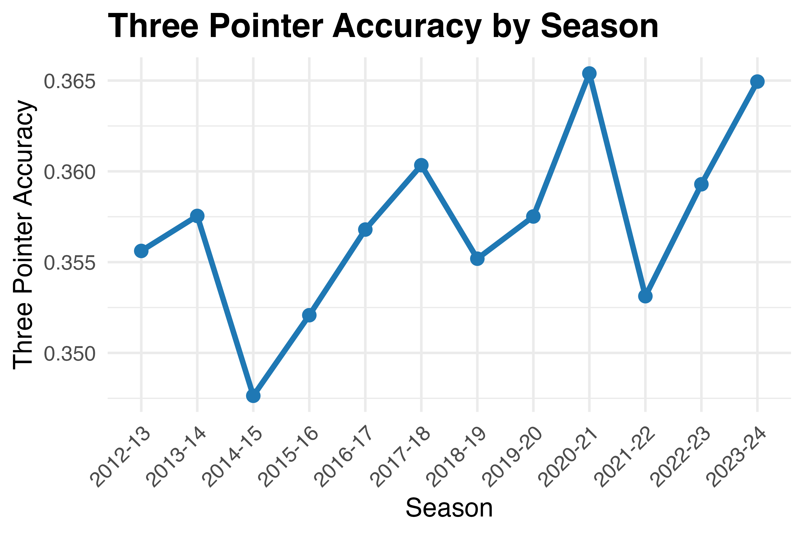
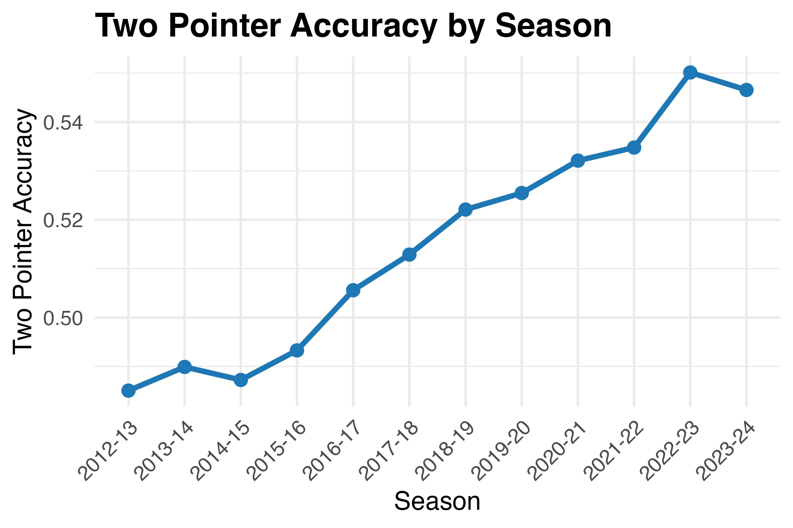
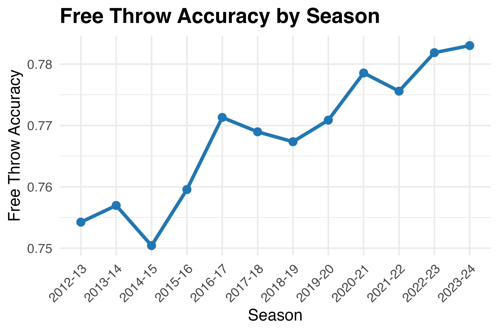
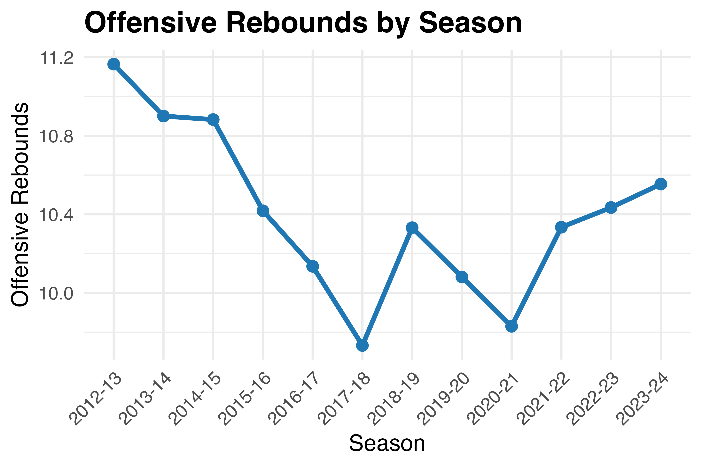
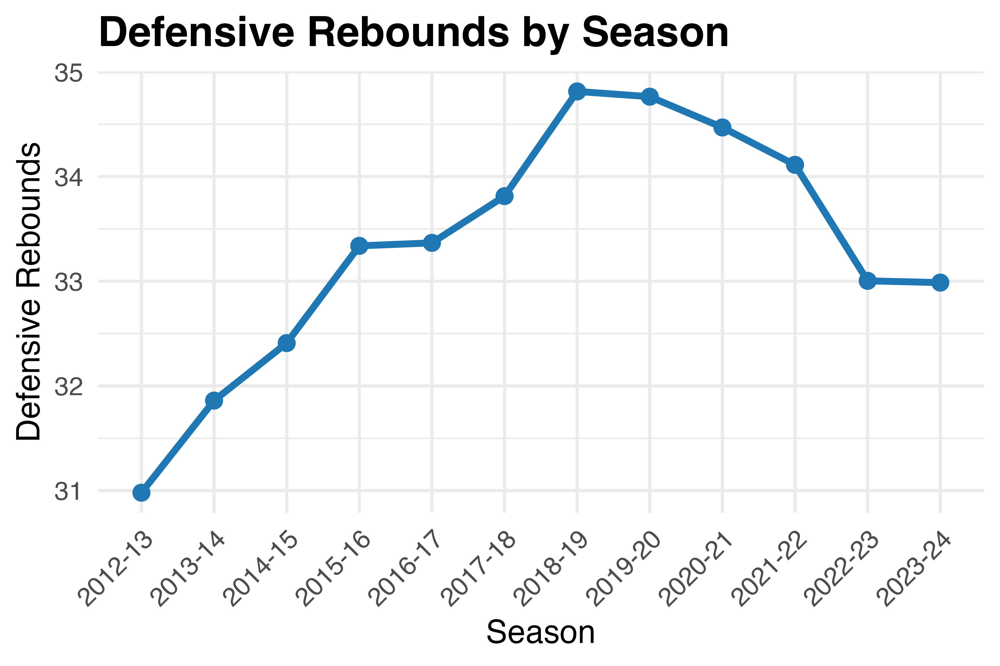
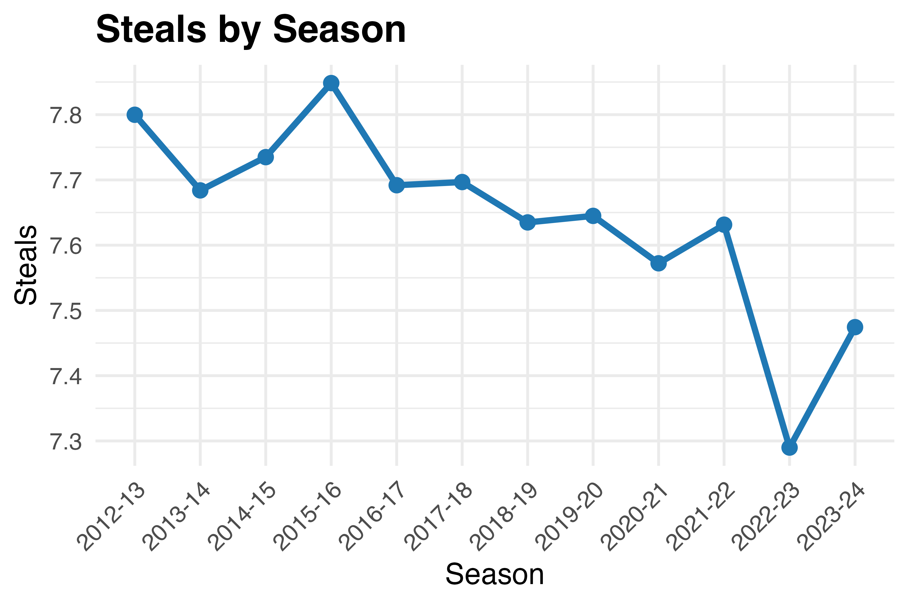

```{r setup, include=FALSE}
knitr::opts_chunk$set(echo = TRUE)
source("util/00_requirements.R")
load("data/43_NBA-Analysis.RData")
```

## Abstract

Dunk or get dunked on — that’s the name of the game when it comes to the NBA. You have twenty-four seconds to sink a shot or get one put down on your hoop, and currently the rules have seemed to strongly favor offenses and penalize physical defenses. Does that mean defense is less useful now, or does defense still play just as crucial a part and simply look different from what we expect? This paper seeks to investigate what efficient defenses and offenses look like by identifying key metrics that aggregate to describe efficient play, and ultimately analyze what wins games more, scoring points or allowing points. To conduct this analysis, we will develop models describing offensive and defensive efficiency and apply nested F-tests across the models and an aggregate to identify which contributes more to winning games. (Insert findings later)

## Introduction

The NBA's rulebook since 2004 and ongoing regularly makes updates that drive the game to at least seem both extremely offense-driven and defense-second, with the latter seemingly being a mere afterthought if not outright not integrated into defensive philosophies. This perception of the game may have a strong sense of truth, but there is a very viable possibility that it only describes half the game and leaves sorely underdeveloped defensive outlook and strategy. To bring the best out of players' technical abilities, strengthen and develop the NBA-seeking talent pool with both the players and aspiring coaches, and help the NBA tangibly understand how to fight now-rampant criticisms of the NBA 'going soft', it is crucial to better understand the current defensive structure of the game and how to best develop it. By analyzing which key metrics contribute to defensive or offensive efficiency and developing models to understand how much each throughput affects winning outcomes, we can create this better understanding of the flipside to the offensive-minded game style. In order to best conduct this analysis, we will break the analysis into two phases.

For the first phase of analysis, we will first categorize the variables into defensive and offensive categories. Once we class the variables, we will test for intercategorical collinearity and develop a full model that selects one variable per collinear relationship to avoid redundancy. Once the full model is developed, we will employ techniques like backwards elimination to develop statistically significant offensive and defensive models that explain a team's win within a game accurately.

For the second phase of analysis, we will then create an aggregate model from the two initial models that is computed as a composite. Using all three models the, we will conduct nested F-tests to determine whether the offensive model or defensive model provides the stronger signal within the composite.

## Data

In order to conduct this analysis on NBA gameplay statistics, we are using [regular season data (original data)]("./data/nba_raw.csv") compiled over a time range from 2010-2024 (Korolyk, 2024). This dataset is compiled by Vasilii Korolyk and is publicly available at https://github.com/NocturneBear/NBA-Data-2010-2024 for academic use under its [MIT License](https://github.com/NocturneBear/NBA-Data-2010-2024?tab=MIT-1-ov-file). The original data contains over 33,000 observations and documents 57 variables over each entry. 

Within the raw data given, one of the variables was not a statistic and was in fact a helpful utility called AVAILABLE_FLAGS, which indicated whether the data was healthy enough for use. As a result, when cleaning the data we initially dropped all entries that didn't have a value of 1, which indicated they were healthy. After dropping those entries, we then removed all variables that have no bearing on the intended research or methodologies along with fully-empty rows. After cleaning, we're left with around 28K observations and 27 variables. The variables for the fully cleaned data are as follows

### Dimensions
- Season
- Team ID
- Team Abbreviation
- Team Name
- Game ID
- Game Date
- Matchup 
- Win/Loss Status

### Metrics
- Field Goals Made
- Field Goals Attempted
- Field Goal Accuracy
- Three Pointers Made
- Three Pointers Attempted
- Three Pointer Accuracy
- Free Throws Made
- Free Throws Attempted
- Free Throw Accuracy
- Offensive Rebounds
- Defensive Rebounds
- Total Rebounds
- Assists
- Turnovers
- Steals
- Blocks
- Blocks Against
- Personal Fouls
- Personal Fouls Drawn

Before we can use this data though, note something of key importance — three point shots are counted as field goals, since they are a type of field goal along with two-point shots. Mathematically,

$$ 
\text{FG} = \text{3P} + \text{2P}
$$

From here we can derive formulas to develop two-point metrics as follows

$$ 
\text{2PA} = \text{FGA} - \text{3PA}, \text{ 2PM} = \text{FGM} - \text{3PM}, \text{ 2P\%} = \frac{\text{FGM} - \text{3PM}}{\text{FGA} - \text{3PA}}
$$

Furthermore, more fundamentally to gameplay, winning can't merely be captured by shot accuracy as total shot count and shot type matter as well. To account for this, we can develop a metric that captures point-driven shot aggression, the three point volume. This can be computed exactly as so

$$
\text{3PV} = \frac{\text{3PA}}{\text{FGA}}
$$

After computing these derived metrics, general field goals is rendered fully obsolete. As a result, we drop the original field goal metrics finally leaving us with a dataset of 28K observations and 28 variables named like so: 

### Dimensions
- Season
- Team ID
- Team Abbreviation
- Team Name
- Game ID
- Game Date
- Matchup 
- Win/Loss Status

### Metrics
- Three Pointers Made (3PM)
- Three Pointers Attempted (3PA)
- Three Pointer Accuracy (3PP)
- Three Point Volume (3PV)
- Free Throws Made (FTM)
- Free Throws Attempted (FTA)
- Free Throw Accuracy (FTP)
- Offensive Rebounds (ORB)
- Defensive Rebounds (DRB)
- Total Rebounds (RB)
- Assists (AST)
- Turnovers (TOV)
- Steals (ST)
- Blocks (BLK)
- Blocks Against (BA)
- Personal Fouls (PF)
- Personal Fouls Drawn (PFD)
- Two Pointers Made (2PM)
- Two Pointers Attempted (2PA)
- Two Pointer Accuracy (2PP)

As a final preliminary to EDA and data visualization, we will also categorize the metrics between offense and defense as follows along with rationale:

### Offensive Metrics
- Three Pointers: Point-scoring event
- Three Point Volume: The proportion 
- Free Throws: Point-scoring event
- Offensive Rebounds: Initiates offensive play via repossession on offensive drive
- Assists: Directly enables and precedes a point-scoring event (two/three pointers)
- Turnovers: Offensive loss of possession
- Two Pointers: Point-scoring event
- Personal Fouls Drawn: Enables a point-scoring event (free throw)
- Blocks Against: Disrupts a point-gaining opportunity for team

### Defensive Metrics
- Defensive Rebounds: Initiates possession after defensive drive
- Steals: Interrupts opponent's offensive drive and initiates possession from defensive play
- Blocks: Disrupts a point-gaining opportunity for opponent
- Personal Fouls: Penalty for illegal defensive maneuver

\newpage
## EDA & Data Visualization

To get a grasp of if and how NBA playstyle has changed across the seasons, we can take a look at time series for certain key metrics.


\begin{center}
\textbf{Figure 1.1: Time Series of Three Point Volume}
\end{center}

3PV is arguably the most crucial into understanding shifts in playstyle, as it encapsulates perfectly how aggressively a team chases points. Additionally, tt exhibits minimal confoundingness since shot selection during possession is binary, and very few rules interfere with the components of the metric. As seen in Figure 1.1, 3PV has seen a sharp increase over the years, and this is about as blatant as it gets with how aggressive teams are with scoring high rather than getting in the paint and fighting towards the rim. Furthermore, league accuracy on the shot has also increased as demonstrated below.


\begin{center}
\textbf{Figure 1.2: Time Series of Three Point Accuracy}
\end{center}

We do see an anomalous inflection for the 2020-21 and 2021-22 seasons, and this is possibly due to the impact of COVID-19 on the league. There may be a concern that computations on data from this time may be suspicious, but we have to acknowledge that the federal lockdown only affected logistics and not gameplay incentive. Regardless, the general upward trend in accuracy further reflects that three-point shooting is a skill emphasized in-game and by extension, a significant aspect of professional training.

\newpage

Several other shot accuracy metrics have gone up as well, albeit far more inconsistently, which still further suggests how important the three point shot has become to the league.

\vspace{1em}


\begin{center}
\textbf{Figure 1.3: Time Series of Two Point Accuracy}
\end{center}


\begin{center}
\textbf{Figure 1.4: Time Series of Free Throw Accuracy}
\end{center}

\vspace{1em}

Figures 1.1-4 all strongly indicate a very shot-heavy offensive play style, that too aggressively for points less so than battle towards the rim and in the paint. This sort of finesse-first style has been perceived as fans as a lack of physicality, and surprisingly the fans are not wrong in this regard. Down below, Figure 1.5 demonstrates how volatile and decentered offensive rebounds have become, which is typically a strong indicator of physical aggression for reposession of the ball after a failed shot attempt.



\begin{center}
\textbf{Figure 1.5: Time Series of Mean ORB Count}
\end{center}

Interestingly though, the tail-end of the graph displays an increase in ORB count in the league and possibly indicates a new type of physical demand far more focused on players just being able to grab the ball after a shot bouncing off the glass. We must emphasize though that this is far from definitive as the tail increase does not make up a significant part of the graph and is too recent to strongly claim a reimagined sense of physicality.

\newpage

Defensive rebounds tell an equally fascinating story of how the league has changed as well, as 1.6 shows below.


\begin{center}
\textbf{Figure 1.6: Time Series of Mean DRB Count}
\end{center}

The first half of the graph shows a clear increase in DRB count for the league, standing sharply against a one-dimensional no-contact, offense-first narrative around modern gameplay in the league. But starting in 2018-2019 season, there is a slow but clearly negative change in defensive rebound count. This could be explained by harsher rules around contact, but the argument doesn't quite fully hold water for DRBs. That story changes fully with a different metric though — steals.

Steals are by far the riskiest defensive maneuver, as they can easily result in illegal contact. It is fair to argue objectively that it is simultaneously a high-risk, high-reward maneuver as it allows the interruption of an opponent's drive and enables a fast break. That's not how the league's teams see it though, and the numbers don't lie.


\begin{center}
\textbf{Figure 1.7: Time Series of Mean ST Count}
\end{center}

Steal count has drastically decreased over the years, and this dramatic decrease indicates a high fear factor for incurring a penalty, which at best gives the opponent an opportunity to reset their drive and pace through and at worst produces a free throw. When paired with Figure 1.4, it understandably becomes a significant concern especially to allow a free throw attempt to be taken. 

\newpage

Naturally, we expect to see that offensive metrics have stronger associations to winning. While the data does seem to corroborate this intuition, especially when a Spearman test is applied, some of the data visually doesn't look strongly associated despite the Spearman test saying otherwise.

\begin{figure}[H]
\centering
\includegraphics[width=0.85\linewidth]{img/plots/Three_Point_Volume_Winningness-For-Props.png}
\vspace{0.75em}
$\rho = 0.017,\ p \approx 0.004$ \\
\textbf{Figure 1.8: Winningness of 3PV}
\end{figure}

\begin{figure}[H]
\centering
\includegraphics[width=0.85\linewidth]{img/plots/Three_Pointer_Accuracy_Winningness-For-Props.png}
\vspace{0.75em}
$\rho = 0.333,\ p < 2.2 \times 10^{-16}$ \\
\textbf{Figure 1.9: Winningness of 3P\%}
\end{figure}

\begin{figure}[H]
\centering
\includegraphics[width=0.85\linewidth]{img/plots/Two_Pointer_Accuracy_Winningness-For-Props.png}
\vspace{0.75em}
$\rho = 0.301,\ p < 2.2 \times 10^{-16}$ \\
\textbf{Figure 1.10: Winningness of 2P\%}
\end{figure}

\begin{figure}[H]
\centering
\includegraphics[width=0.85\linewidth]{img/plots/Assists_Winningness.png}
\vspace{0.75em}
$\rho = 0.296,\ p < 2.2 \times 10^{-16}$ \\
\textbf{Figure 1.11: Winningness of Assists}
\end{figure}

\newpage

Spearman tests confirm extremely significant results indicating that several of these offensive metrics have not only a strong association with winning ability, but also a positive one at that. Naturally so, but a good reminder to have due to the perception of offense-only, defensive metrics strongly associate as well.

\begin{figure}[H]
\centering
\includegraphics[width=0.85\linewidth]{img/plots/Steals_Winningness.png}
\vspace{0.75em}
$\rho = 0.296,\ p < 2.2 \times 10^{-16}$ \\
\textbf{Figure 1.12: Winningness of Steals}
\end{figure}

\begin{figure}[H]
\centering
\includegraphics[width=0.85\linewidth]{img/plots/Blocks_Winningness.png}
\vspace{0.75em}
$\rho = 0.164,\ p < 2.2 \times 10^{-16}$ \\
\textbf{Figure 1.13: Winningness of Blocks}
\end{figure}

\begin{figure}[H]
\centering
\includegraphics[width=0.85\linewidth]{img/plots/Defensive_Rebounds_Winningness.png}
\vspace{0.75em}
$\rho = 0.355,\ p < 2.2 \times 10^{-16}$ \\
\textbf{Figure 1.14: Winningness of Defensive Rebounds}
\end{figure}

\newpage

As a result of these strong findings, we can move forward with analysis on logistic regression fits for both offensive and defensive models, and then further check which contributes more to winningness.

\newpage

## Analysis

Firstly, we develop an offensive model via logistic regression against winningness. Note that during logistic regression, the range will produce $\text{W} \in \text{ }[0,1]$, but it is incorrect to interpret a select value of $\text{W}$ as a true probability of winning, as this is not a predictive model and is only inferential. Let us describe this full model as such

$$\mathscr O(X)=\mathbb{E}[Y|X]$$
$$ \mathscr O : Y=f(X)+ \epsilon$$

$$ P(Y=1|X) = \frac{1}{1+e^{-z}} $$

$$  z= \beta_0 \text{3PV} + \beta_1 \text{3PP} + \beta_2 \text{2PP} + \beta_3 \text{FTP} + \beta_4 \text{AST} + \beta_5 \text{ORB} + \beta_6 \text{TOV} + + \beta_7 \text{PFD} + \beta_8 \text{BA}$$


After running the regression, the full model produces these results.

``` {r, results='asis', echo=FALSE}
stargazer(
  offense_model,
  type = "latex",
  title = "Offensive Logistic Regression Results",
  dep.var.labels = "Win Probability",
  covariate.labels = c("3PV", "3PP", "2PP", "FTP", "AST", "ORB", "TOV", "PFD", "BA"),
  digits = 3,
  no.space = TRUE,
  omit.table.note = TRUE,
  header = FALSE
)
```

Since all metrics are statistically significant, there is no backwards elimination needed.

Next, we develop an defensive model in a very similar way. Let us describe this full model as such

$$\mathscr D(X)=\mathbb{E}[Y|X]$$
$$ \mathscr D : Y=f(X)+ \epsilon$$

$$ P(Y=1|X) = \frac{1}{1+e^{-z}} $$

$$  z= \beta_0 \text{ST} + \beta_1 \text{DRB} + \beta_2 \text{PF} + \beta_3 \text{BLK}$$

After running the regression, the full defensive model produces these results.

``` {r, results='asis', echo=FALSE}
stargazer(
  defense_model,
  type = "latex",
  title = "Defensive Logistic Regression Results",
  dep.var.labels = "Win Probability",
  covariate.labels = c("ST", "DRB", "PF", "BLK"),
  digits = 3,
  no.space = TRUE,
  omit.table.note = TRUE,
  header = FALSE
)
```
Once more there are no predictors to prune, so we leave the full defensive model as is.

Finally, we can produce a full model $\mathscr F$ such that

$$ \mathscr F = \mathscr O + \mathscr D $$

In similar fashion we produce and regress  $\mathscr F$, yielding the following results.

``` {r, results='asis', echo=FALSE}
stargazer(
  full_model,
  type = "latex",
  title = "Full Logistic Regression Results",
  dep.var.labels = "Win Probability",
  covariate.labels = c("ST", "DRB", "PF", "BLK"),
  digits = 3,
  no.space = TRUE,
  omit.table.note = TRUE,
  header = FALSE
)
```

\begin{figure}[H]
\centering
\includegraphics[width=0.85\linewidth]{img/plots/corr_heatmap.png}
\vspace{0.75em}
\textbf{Figure 2.1: Correlation Heatmap}
\end{figure}

To verify that there is no colinearity, we can refer to 2.1 and identify hot cells corresponding to metrics in the model.

We only observe a seemingly-strong colinearity between 2PP and ORB, so we verify using a Pearson test.

\begin{figure}[H]
\centering
\includegraphics[width=0.85\linewidth]{img/plots/Two_Pointer_Accuracy_vs_Offensive_Rebounds.png}
\vspace{0.75em}
$\rho = -0.31, \text{ } p < 2.2 \times 10^{-16} $
\textbf{Figure 2.2: Correlation Heatmap}
\end{figure}

While the p value indicates high significance of colinearity, we must keep in mind that the the sample size is $n = 28446$, and therefore paired with the low $\rho$ value we ignore any such issues.


Finally we can execute a nested likelihood-$\chi^2$ test to see which of the smaller model contributes more to the full composite model. Here are the results

```{r nested-table, echo=FALSE, results='asis'}
cat("
\\begin{table}[H]
\\centering
\\caption{\\textbf{Analysis of Deviance for Nested Logistic Models}}
\\begin{tabular}{lcccc}
\\toprule
Comparison & Model & Residual Df & Residual Dev & Deviance Drop \\\\
\\midrule
Defense → Full & Defense Only & 28441 & 33777 & \\\\
               & Full Model   & 28432 & 21617 & 12160 \\\\
\\midrule
Offense → Full & Offense Only & 28436 & 30449 & \\\\
               & Full Model   & 28432 & 21617 & 8832 \\\\
\\bottomrule
\\end{tabular}
\\end{table}
")
```

## Conclusions
We can conclusively say that the stereotype is more or less right — offense contributes significantly more to winning games. Both defense and offense significantly contribute to a winning game, but that finding is more or less trivial. The difference from the ANOVA tables strongly indicates that offense clearly has the stronger contribution between the two.

## Conclusion


## Citations

Korolyk, Vitalii. “NBA Data 2010-2024 by NocturneBear.” GitHub, NocturneBear, 2024, github.com/NocturneBear/NBA-Data-2010-2024. 

[](https://github.com/NocturneBear/NBA-Data-2010-2024)


